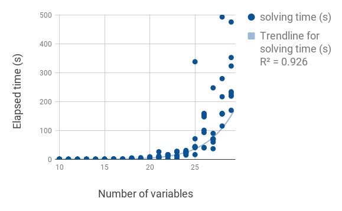
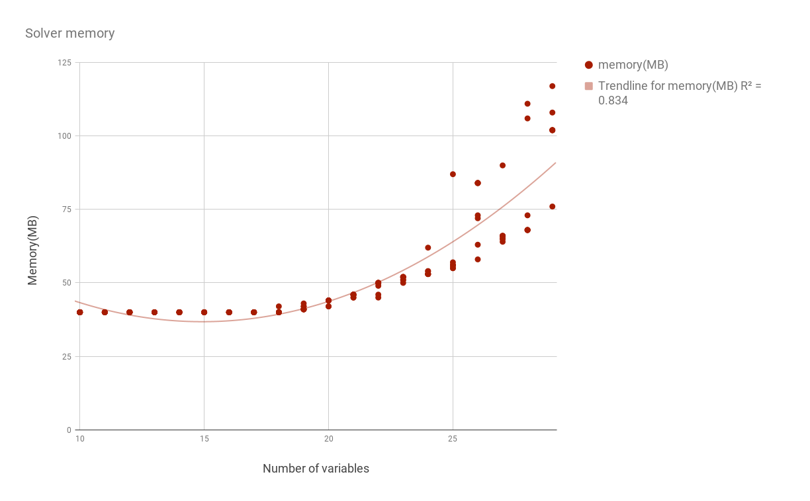

# Correlation clustering

## Using the script
The script read an input file where the first line are the variable names (integers largre than 1)
and all the subsequent lines are triples where the first two numbers are the variables and the last
number is the correlation of the pair.
Below an example with 5 variables `1,23,7,4,5` and two correlations:

```
1 23 7 4 5 
1 23 -1
7 4 1
```
You can then run the main script on the input:
```bash
python correlation_clustering.py input_file
```


## Benchmarks
In the `./bench` folder, you can generate random benchmarks by executing the python script:
```python3 bench.py```
Then, convert the correlation matrix files to the encoder input format:
```python3 convert.py```
Now back in this folder (`corrClus`) you can execute the benchmarking script:
```python3 bench.py NUMBER_OF_BENCHMARKS```

## Tests
There are a few correctness tests in the `tests` folder. If you want to check the correctness of `solve` after a
modification, execute the `test.py` script.

## Results
Results are compiled in `results.csv`. `memory.png` shows how much memory is used by MaxHS to sovle the encoded problem
 for different  numbers of variables (there are n(n-1)/2 weights for n variables). `runtime.png` 
 shows how much time is spent solving the problems.
 
 
 
 
 
 